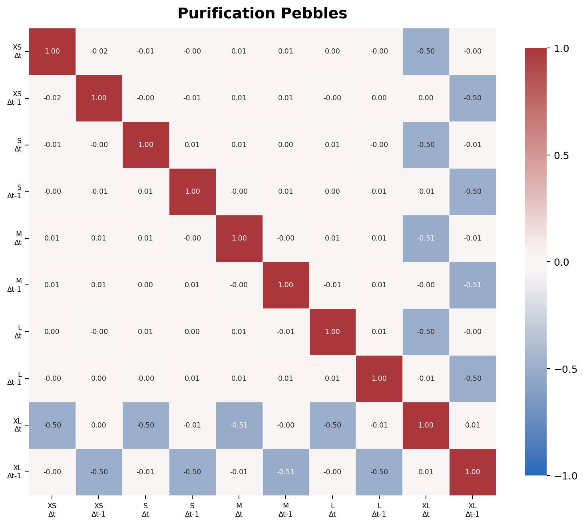
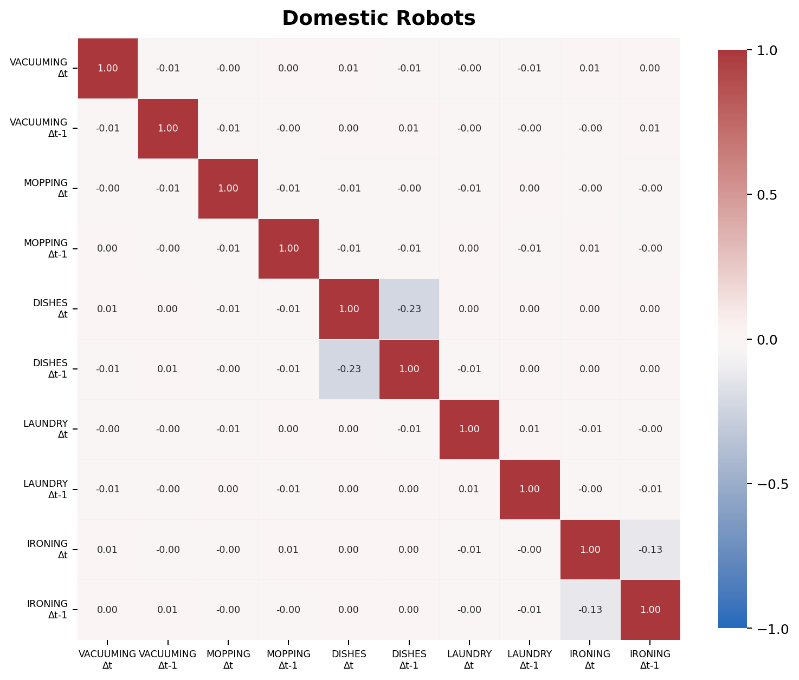
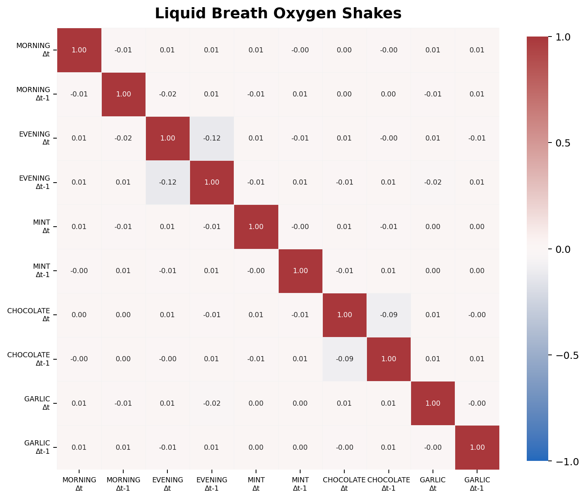
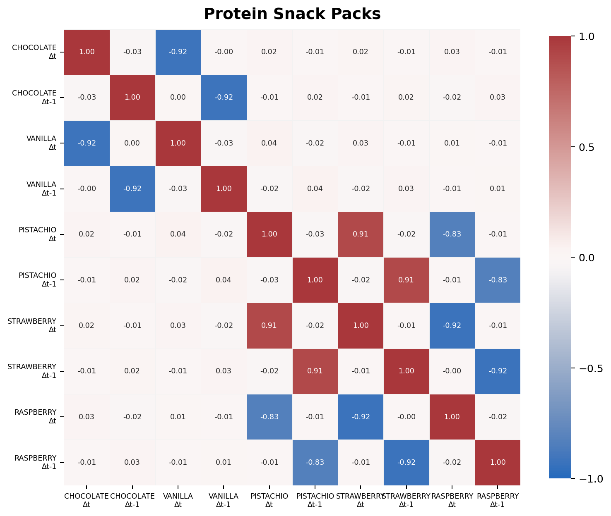
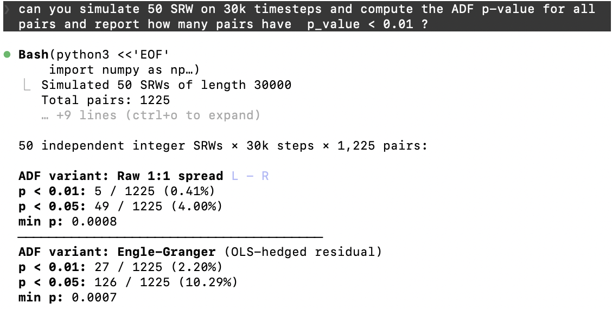

# IMC Prosperity 4

Team `rat_hunters` (United States) finished **#$2$** in Phase 2 of IMC Prosperity 4, with cumulative Phase-2 PnL of $1{,}459{,}764$ XIRECs (Algo $1{,}220{,}042$ + Manual $239{,}722$). On the algorithmic challenge alone, we finished #$3$ globally at a $500$ XIRECs difference from the second place on algo.

## Round 3 — Mean reversion

**Algo PnL: $+297{,}716$** • **Algo rank for this round: #$4$**

The first instinct for this round was to attempt some IV-based strategies. However, after realizing that the fluctuations in the IV accounted for $\pm 2$ moves in the price, we dropped the whole options business.

After this, Maxime started making positive PnL on both products with mean reversion and then it hit me - this is Prosperity, mean reversion MUST be the answer to all your problems. A quick analysis on `VELVET_FRUIT` and `HYDROGEL_PACKS` showed that they have negative autocorrelation, which could be explained by mean-reversion. If it looks like MR, walks like MR and it's Prosperity, it probably is MR.

***Strategy:*** Our strategy for the two products was exactly the same - find a fair value (for `VELVET_FRUIT`: `5250`, for `HYDROGEL_PACKS`: `9990`); find a symmetric threshold for the deviation from fair value when to enter a position (for `VELVET_FRUIT`: `28`, for `HYDROGEL_PACKS`: `40`); when the price crosses `fair +- threshold` send a signal to fill up your position respectively (this could take a few ticks). We had no liquidation upon reversion, just buy at lows and sell at highs (and of course, for `VELVET_FRUIT`, do the same for its respective options). $100$ lines of code. 

## Round 4 — Mean reversion

**Algo PnL: $+221{,}170$** • **Algo rank for this round: #$20$**

Round 4 de-anonymized the trade tape: every fill carried a counterparty ID. However, we did not find anything interesting so we did not use any bot behaviour.

However, we noticed that `HYDROGEL_PACKS` downward excursions had a median peak of $20$, while upward excursions had a median peak of $40$. This meant that symmetric thresholds were suboptimal.

***Strategy:*** Same as round 3, except we introduced asymmetric thresholds for `HYDROGEL_PACKS` - we used buy threshold at `-8` from fair and sell at `+40` from fair price. 

**P.S: Despite being ranked #$4$ and #$20$ for Algo Round 3 and 4, we still ended up at #$3$ for Algo when combining the two rounds. I wonder why ;)**

## Round 5 — The New Prosperity!

**Algo PnL: $+701{,}157$** • **Algo rank for this round: #$8$**

After $5$ hours of sleep I woke up at $7$ am and the first thing I saw were our teammates on east coast saying we're $2$nd place. There were also $50$ (fifty!) new products, split across $10$ sectors and each had $5$ respective products. Needless to say, against my best efforts, I couldn't go back to sleep. This wasn't just for fun anymore :) 

### Finding Nemo (Alpha).
First thing first - we plotted first-order differences correlations within groups. This gave away almost all the alphas and the products we worked on the first day of Round 5. Below are the heatmaps that had anything significant.

  
  

  
  

Another interesting correlation fact was that Snackpacks as a sector was correlated with the rest of the market (and it was quite significant, at $0.22$ correlation for first-order differences). Unfortunately, we did not have the time to explore this direction.

### Pebbles — basket arbitrage

We noticed that Pebbles' prices summed up to $50{,}000$ consistently with the exception of some steps where it deviated by $\pm 15$ and reverted immediately in the next tick. We found that it was rarely profitable to take a position on these deviations due to the spread. We realized that Market Making is a risk-free strategy here due to the bots always trading the same quantities at the same timestamps for all the pebbles simultaneously. We netted around $18$k/day with Market Making and taking at the deviations when it was profitable accounting for the spread.

### Snackpacks

The very high negative correlation between `SNACKPACK_VANILLA`/`SNACKPACK_CHOCOLATE` might signal cointegration. However, if you ran ADF, the reported p-value was quite large. In particular, while high correlation can be signaled by cointegration, it does not necessarily imply it. In fact, very high correlation probably rules out pairs trading - think about a stock that always copies or reverts the move of another one. Not too tradeable IMHO.

We found that `SNACKPACK_VANILLA − SNACKPACK_RASPBERRY` spread is the cleanest mean-reverting signal in the family - second-to-best ADF p-value, median almost 0, and also ties together all the products. When the spread crosses `±100` we sent a signal to fill up our positions. Since `SNACKPACK_CHOCOLATE` was so negatively correlated with `SNACKPACK_VANILLA` and `SNACKPACK_STRAWBERRY` with `SNACKPACK_RASPBERRY`, we used the `SNACKPACK_VANILLA`-`SNACKPACK_RASPBERRY` signal to also go on a respective `SNACKPACK_STRAWBERRY`-`SNACKPACK_CHOCOLATE` position. `SNACKPACK_PISTACHIO` was treated as an "excluded" product that we used market making on.

### Lattice movements - the bread-winner

`ROBOT_DISHES`, `ROBOT_IRONING`, `OXYGEN_SHAKE_EVENING_BREATH`, and `OXYGEN_SHAKE_CHOCOLATE` exhibited a discrete-grid micro-structure: mid mostly walks in small ticks, but occasionally it started moving by $\pm 100$ positions. This could've been explained by the fact that the mid price was rounded to a point on a $100$-wide lattice. By standard martingale reasons this would've implied that after a $100$ swing one way the next swing was going to be most likely in the opposite direction. A quick empirical check confirmed this - after the price moved by $\pm 100$ the next move was $\mp 100$ with $85\%$ chance. The strategy at this point is trivial - whenever you move by $+100$ sell till full inventory and when it moves by $-100$, buy till full inventory.

### Microchips — within-family lead-lag

The Microchip family is the only Round 5 group where a clean integer-lag signal exists between products. `MICROCHIP_OVAL`, `MICROCHIP_SQUARE`, `MICROCHIP_RECTANGLE` and `MICROCHIP_TRIANGLE` all followed `MICROCHIP_CIRCLE` at a $50$, $100$, $150$ and $200$ lag, respectively. The correlation was rather weak - around $0.05$. However, when aggregated over multiple steps it could've been a tradeable signal. To our surprise, when aggregating multiple difference, i.e. looking at $\text{MICROCHIP\_RECTANGLE}_{t+300} - \text{MICROCHIP\_RECTANGLE}_{t+150}$ and $\text{MICROCHIP\_CIRCLE}_{t+150} - \text{MICROCHIP\_CIRCLE}_{t}$, the correlation jumped to $0.15$. This should not happen if there was no other hidden structure for this family. We searched hard for the other systematic pattern, but failed to find it. For unfounded reasons we resorted to overfitting - we aggregated the price difference over larger windows than what was logical (i.e, looked at $\text{MICROCHIP\_CIRCLE}_{t+200} - \text{MICROCHIP\_CIRCLE}_{t}$ to predict $\text{MICROCHIP\_RECTANGLE}_{t+400} - \text{MICROCHIP\_RECTANGLE}_{t+200}$) and sweeped for thresholds. Needless to say, we netted an embarassing $-25$k on microchips as a group. Nonetheless, this was the most fun asset (class) of all of Prosperity - it really made us think and write down math. I would come back next year just for a round where we get another chance to trade such products.

### General market making

Every Round 5 product that isn't claimed by the four strategies above gets a basic two-sided passive MM: post `(best_bid + 1, best_ask − 1)`. The exclusion set in `PROB_MM_EXCLUDED` ensures the MM layer never fights another strategy when the logic was getting too messy. One thing to mention about MM is that all products got traded at the same time, in the same quantities and in the same directions. Hence, we exposed ourselves to the overall movements of the market. However, we found the market to be overall stable, and we were equally exposed to gaining from directionality as we were to losing, so it seemed sensible to keep market making.

## Overfitting

### Round 3 and 4
I want to mention that the amount of overfitting reported in discord was actually insane - z-scores, bellinger (?), EMA, blah blah. Before implementing any of these you should have a solid reason. For example, if you take a rolling mean as your "fair price" and plot the residuals you will find that the later was also mean reverting. However, this holds true for almost any time series under the sun :). You would need a more rigorous analysis to claim that a local mean-reversion would be more profitable than a global mean-reversion that would necessarily have to include the stability of the rolling mean. 

You should really think what you are trading here - you are betting that the current price is too high for whatever happened in the past $100$ ticks, and that it is going to revert, in say $1000$ ticks. Then you are selling now, and then in $1000$ ticks you would want to buy back because the rolling mean in $900$ ticks will be lower than the price in $1000$ ticks? Take a step back to think what exactly you are doing. The rolling mean could've drifted as well - what if rolling mean started dropping itself and the $1000$th was higher with respect to the rolling mean, but substantial lower than when you bought? If there are no fundamental statistics to confirm that you do not expose yourself to too much movement in the rolling mean then you should just assume overfit if the PnL on backtest is good. 

Needless to say, I am not claiming that local-mean reversion is bad, all I am trying to communicate is that there needs to be concrete reasoning and logic to back this up. Better backtest results is not logic, it's just a number :) 

### Round 5 
When I opened discord and saw the reported backtest PnLs I was pleasantly surprised. People were reporting $1.8$mln backtests, or even upwards of $2.2$mln. In total we had $50$ products, sure, but positions were $10$ for all of them. This was significantly less positions than what we could've taken in round 3 and 4. It was clear that everyone was pulling mean-reversion and cointegration out of thin air. And to be fair, if you looked at the graph of some random UV product and then some sleeping-pod, maybe, it looked like you could pairs trade them. And that's totally normal, in fact, in the training sample, I am sure that tens, if not hundreds of pairs exhibited a cointegration pattern. In fact, if you simulate $50$ simple random walks on $30{,}000$ steps and check their ADF p-values you will get something like this:

  

Quite astonishing, over $100$ pairs that you could arbitrage. Yet, if you take a step back, and remember that these are simple random walks you will realize that there is no way you can trade them profitably. This is the multiple testing problem - when you have so many random variables, some will exhibit certain structures that are there just by chance. And in the little experiment we made, as well as in Round 5, these structures held true only on training data, and not on the evaluation data. 

***Take a step back and think what you are doing. Think about your evidence for a strategy - is it just "this strategy does well for these products" or do you have some fundamentals to back it up? Or is there any logic to back this up? Trust your logic and reasoning before you trust your backtester.***

## Manual
To be fair our manual was not the brightest, so we will keep it short.

### Round 3 - Crowd $+70{,}684$

### Round 4 - Options $+65{,}024$
We did Markowitz and looked at the PnL graph against the std for various values of the regularizer lambda. Then, we picked the lambda where the derivative started to get smaller - i.e. where we were trading off more PnL for less std. Did not spend too much time on this, hence the rather straightforward and naive strategy. 

***Interesting stuff:*** However, we realized afterwards that this round is amazing. Due to the extreme variance, around $30\%$ of the seeds would've resulted in the most popular (max-EV) solution either ganing or losing $500$k. No one who puts this much effort into making a competition as IMC does would let this kind of noise simply randomize the top ranks. Hence, you definitely could've expected that the seed would've been changed once, twice or a few times. This radically changes the outcome of any strategy, especially that you know which "randomness" is the "bad randomness". And I think this aspect is great, because IRL you should never believe someone who tells you that a stock price is a geometric brownian motion. Humans move the price with their actions, just how the mods have the final say on which seed gets used :) 

Also, it's amazing that Manual could've finally been of importance for the general challenge. 

### Round 5 - News $+104{,}014$
For this round just lookup the news from last year that you can find on the internet and try to pattern match. You should be able to recover the movements from most of last years since they are publicly available too. Then assume everyone is already doing that and don't overthink too much - the price moves based on what other contestants do too (don't forget to read the wiki).

